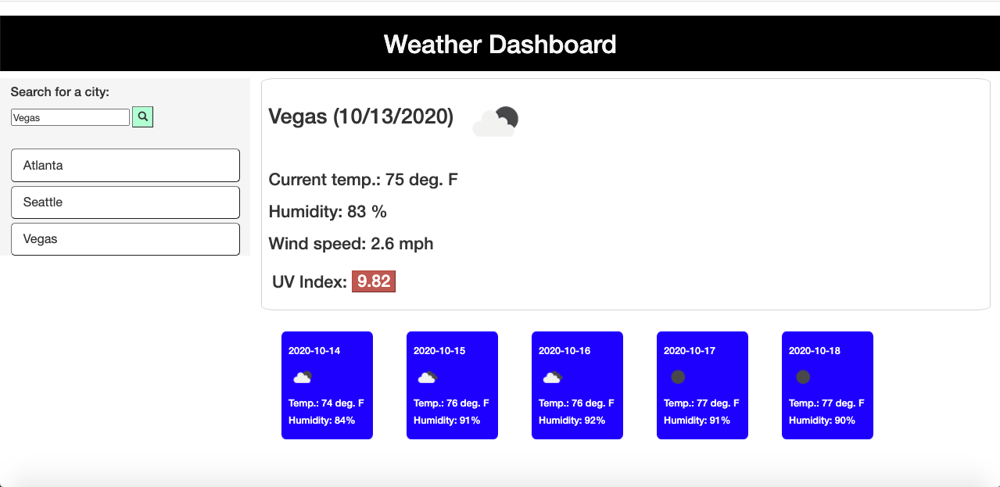

# a-weather-dashboard

This is a weather dashboard that displays both the current weather and the 5 day forecast for a selected city. For each city search, a search history is generated as new buttons below the input field.

URL of deployed app: https://204039643.github.io/a-weather-dashboard

- [Installation](#installation)
- [Usage](#usage)
- [Credits](#credits)
- [License](#license)

## Installation

Clone my Github repository to your local machine: https://github.com/204039643/a-weather-dashboard

## Usage

1. Open webpage in browser: https://204039643.github.io/a-weather-dashboard
2. Input a city of interest and click the search icon.
3. City current weather conditions as well as 5 day forecast will be displayed for selected city. UV index value will be color coded by severity (mild, moderate, severe).
4. Use search history buttons to view conditions and forecast for prior searches.
5. Refresh the webpage and the last city searched from prior session will populate with weather conditions and forecast.

## Credits

W3C Schools HTML JavaScript: https://www.w3schools.com/js/default.asp
MDN web docs JavaScript: https://developer.mozilla.org/en-US/docs/Web/JavaScript
Bootstrap components: https://getbootstrap.com/docs/4.5/getting-started/introduction
openweathermap api's: https://openweathermap.org/api

## License

MIT License

Copyright (c) [2020] [Justin Sykes]

Permission is hereby granted, free of charge, to any person obtaining a copy
of this software and associated documentation files (the "Software"), to deal
in the Software without restriction, including without limitation the rights
to use, copy, modify, merge, publish, distribute, sublicense, and/or sell
copies of the Software, and to permit persons to whom the Software is
furnished to do so, subject to the following conditions:

The above copyright notice and this permission notice shall be included in all
copies or substantial portions of the Software.

THE SOFTWARE IS PROVIDED "AS IS", WITHOUT WARRANTY OF ANY KIND, EXPRESS OR
IMPLIED, INCLUDING BUT NOT LIMITED TO THE WARRANTIES OF MERCHANTABILITY,
FITNESS FOR A PARTICULAR PURPOSE AND NONINFRINGEMENT. IN NO EVENT SHALL THE
AUTHORS OR COPYRIGHT HOLDERS BE LIABLE FOR ANY CLAIM, DAMAGES OR OTHER
LIABILITY, WHETHER IN AN ACTION OF CONTRACT, TORT OR OTHERWISE, ARISING FROM,
OUT OF OR IN CONNECTION WITH THE SOFTWARE OR THE USE OR OTHER DEALINGS IN THE
SOFTWARE.
